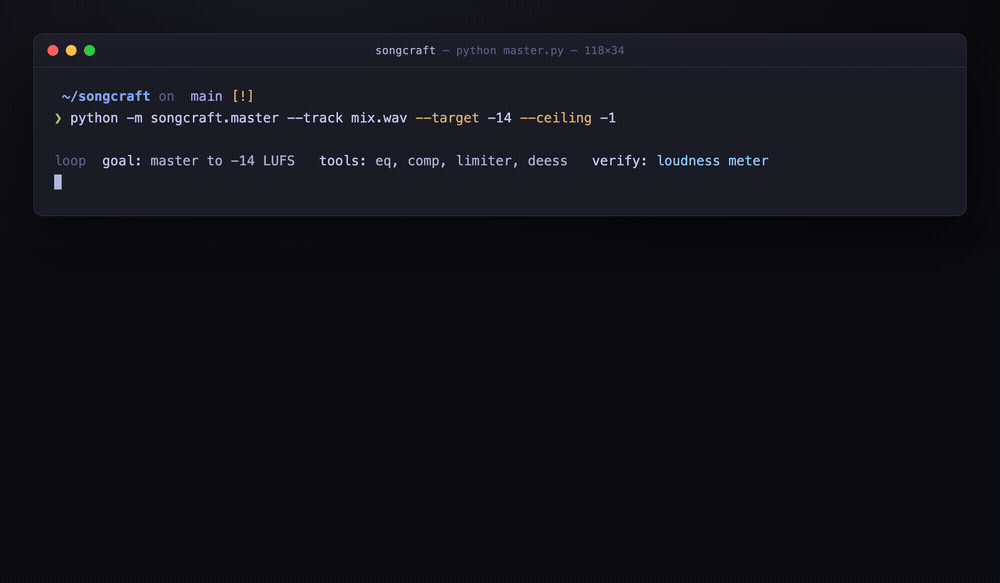
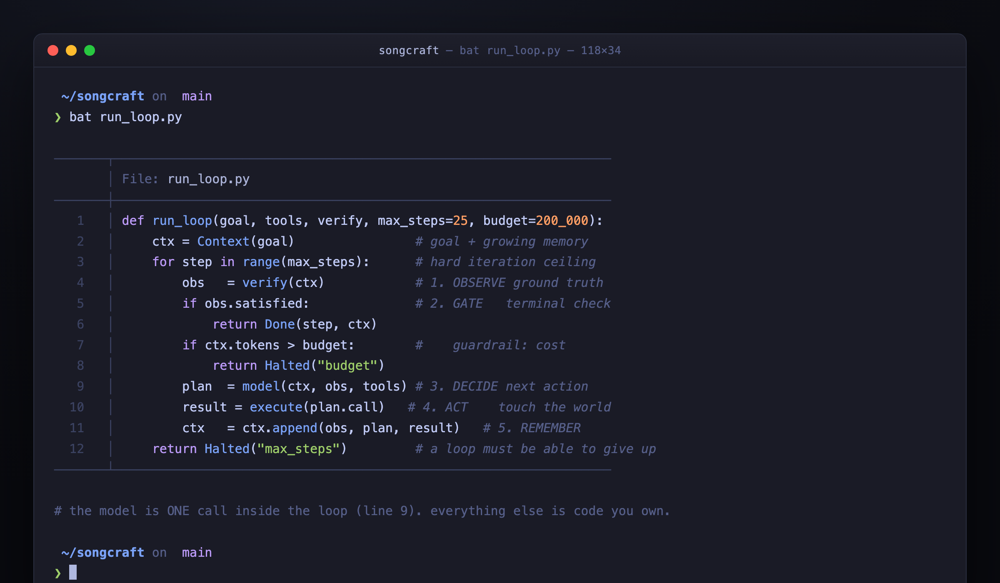
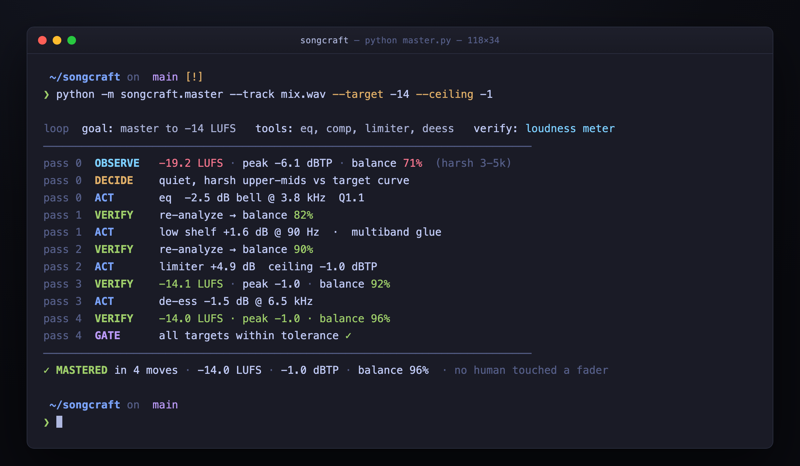
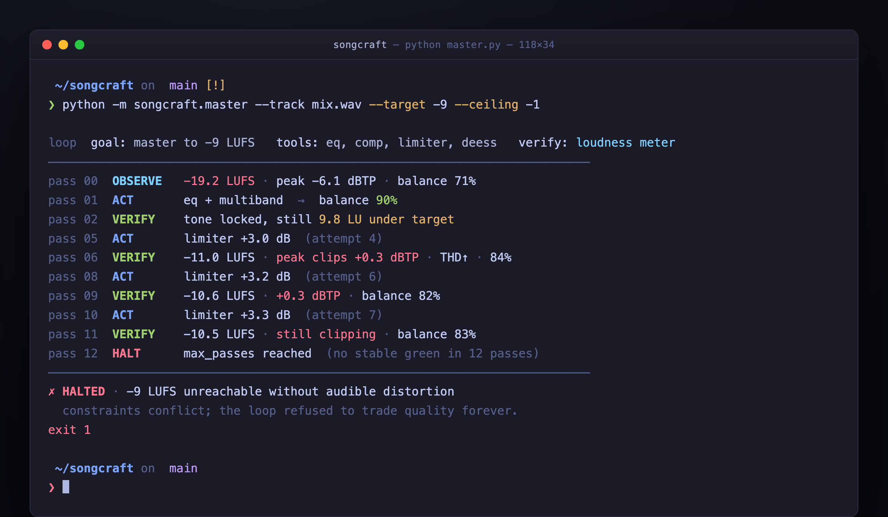

# Stop prompting. Start building loops. (WIP)

**The highest-leverage engineers stopped writing prompts. They write the _loop_ the model runs inside, then let it decide what to do next.**

> ▶ **[Open the live, interactive version](https://akshayvishwanath2702-code.github.io/agent-loops/)** — step through the anatomy and run the auto-mastering loop yourself.



---

## A prompt is a function call. A loop is a program.

A prompt maps one input to one output. You assemble the context, fire it off, read the tokens, and decide what happens next. It is `f(x)`. Genuinely useful, but every unit of work still costs one unit of *your* attention. You are the scheduler, the memory, and the control flow.

A loop inverts that cost structure. You specify a **goal**, hand the model a set of **tools** and a **verifier** that reports ground truth, then let it iterate (observe, act, check) until the goal is met or a guardrail trips. Your attention cost per unit of work trends toward zero. The model is not smarter inside a loop. It just gets to try, look at the real result, and correct itself. That feedback is the thing that separates an engineer from an autocomplete.

> **The leverage was never in a cleverer prompt. It is in the loop you build around an ordinary one.**

Three eras, one variable: how many times a human has to touch the work to move it forward.

- **Prompt:** you assemble context, read output, decide the next step. `1` human touch per unit of work.
- **Chat:** you steer across turns, but every observation still routes through you. `N` touches.
- **Loop:** define goal, tools, verifier once, then step out. `~0` touches. This is where leverage compounds.

---

## Anatomy of a loop. Six parts, and one is the whole game.

Strip away the framework branding and every agent loop is the same short program. A goal goes in, and the loop repeats a fixed cycle until a terminal condition fires: observe ground truth, check the terminal gate, decide the next action, act on the world, remember, repeat.



```python
def run_loop(goal, tools, verify, max_steps=25, budget=200_000):
    ctx = Context(goal)                # goal + growing memory
    for step in range(max_steps):      # hard iteration ceiling
        obs   = verify(ctx)            # 1. OBSERVE ground truth
        if obs.satisfied:              # 2. GATE   terminal check
            return Done(step, ctx)
        if ctx.tokens > budget:        #    guardrail: cost
            return Halted("budget")
        plan  = model(ctx, obs, tools) # 3. DECIDE next action
        result = execute(plan.call)    # 4. ACT    touch the world
        ctx   = ctx.append(obs, plan, result)  # 5. REMEMBER
    return Halted("max_steps")         # a loop must be able to give up
```

> **The verifier is the whole game.** A loop without ground-truth feedback is not autonomous. It is a random walk with good posture.

Notice what the model is not. It is not the loop. It is one call inside it, the `DECIDE` step. Everything that makes the system reliable (observation, the terminal gate, the budget guard, the memory append) is ordinary code you own. The intelligence is rented. The reliability is yours to engineer.

---

## Worked example: the auto-mastering loop inside Songcraft.

Here is a real one. Songcraft is an AI music platform I am building, and one part of it masters a finished track to release spec without a human ever touching a fader. That piece is a loop, not a prompt.

- **Goal:** hit target loudness and tonal balance (`-14 LUFS`, true peak `<= -1 dBTP`).
- **Tools:** EQ, multiband compression, a limiter, de-essing.
- **Verifier:** a set of audio measurements. Integrated loudness in LUFS, true peak in dBTP, spectral balance against a target curve. You cannot argue with a loudness meter. A track is at target, or it is not.

Run it and it converges, because the verifier is trustworthy.



Now point it at an aggressive loudness target the material cannot hit cleanly (`-9 LUFS`) and the same loop fights itself. Every gain boost pushes true peak over the ceiling, the limiter clamps harder, the balance degrades, and it never settles. `max_passes` is what ends the run. That failure is the entire argument for terminal conditions, made visible.



> ▶ **[Run both scenarios yourself in the live version.](https://akshayvishwanath2702-code.github.io/agent-loops/)**

---

## Where the engineering actually lives.

Wrapping a `while` loop around a model call is a weekend demo. Making it survive contact with reality is the job. These six are where loops die in production, and not one of them is a prompt problem.

1. **Termination.** A goal you cannot verify is a goal that never ends. Bound everything: `max_steps`, wall clock, token budget, and a no-progress counter that halts when the last `N` steps changed nothing.
2. **Verification.** The model asserting "done" is not evidence. Wire the check to something unforgeable: a test runner, a type checker, a loudness meter, a schema. Cheap, deterministic, adversarial-proof, in that order.
3. **Context.** Appending every observation blows the window and buries the signal. Summarize, evict, and retrieve. What the model sees at step 20 is a design decision, not an accident of concatenation.
4. **Cost.** A prompt costs one call. A loop costs `steps x tools x retries`, unattended, at 3 a.m. Meter it, cap it, and make the budget a first-class terminal condition, not a surprise on the invoice.
5. **Recovery.** Tools error, time out, and half-apply. Design actions to be safely retryable, checkpoint state between steps, and let the loop resume rather than restart after a fault.
6. **Blast radius.** An autonomous actor needs a sandbox, least-privilege tools, and a human gate on irreversible moves. The question is not "will it err." It is "what is the worst a single bad step can do."

---

## Your new job: loop design.

None of those hard parts were "write a better prompt." The prompt is one line in the program. The craft moved up a level. You are no longer the operator feeding the model. You are the control theorist deciding what the closed loop is even allowed to do. Four decisions carry almost all of it:

| Decision | The question you are actually answering |
|---|---|
| **Goal spec** | What does *done* mean, in a form a machine can check? If you cannot write the terminal condition, you do not have a loop. You have a hope. |
| **Tool surface** | What can it touch? Every tool is both a capability and a blast radius. The minimal set that can reach the goal is almost always the right one. |
| **Verifier** | How does it know it is right without asking itself? This is the single highest-leverage component you will build. Invest here first. |
| **Stop condition** | When does it quit, win or lose? Convergence, budget, iteration ceiling, no progress. A loop that cannot stop is not autonomous. It is unsupervised. |

> **You did not stop being an engineer. You stopped hand-cranking every step, and started designing the machine that cranks itself.**

---

## The takeaway

The next time you catch yourself iterating on a prompt for the fifth time, tweaking a word, rerunning, reading, tweaking again, stop. That loop already exists. It is just running on *you*. Ask the sharper question: **what would it take to move that loop off my attention and into code?**

Define the goal so a machine can check it. Give it the smallest set of tools that can reach it. Build the verifier before you build anything else. Bound it so it can fail safely. Then step out of the loop, and go design the next one.

Prompts got you a collaborator. Loops get you leverage.

---

<sub>Written by Akshay Vishwanath. The diagrams and the loop simulator are live and interactive at the [GitHub Pages site](https://akshayvishwanath2702-code.github.io/agent-loops/). If this was useful, a star or a repost is the best compliment.</sub>
